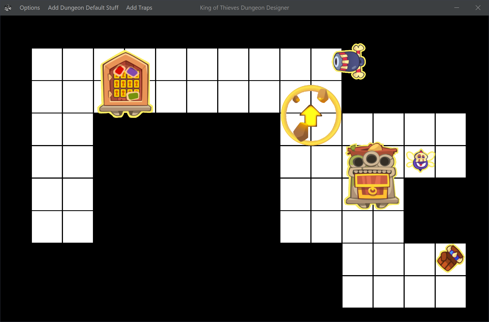

  

<h1 dir="auto" align="center">King Of Thieves Dungeon Designer</h1>

## ``About this ⚒``

The King Of Thieves Dungeon Designer, King of Thieves DD, or Kot DD is a Java made application that allows the user to create any type of dungeon, with any number of traps and other stuff. The main use for this app is, in the case that someone asks you what layout for a certain dungeon it's the best, you open Kot DD and you create the best layout you think there is. 

For example, for the current version of the program, editing a layout for the ``base 73`` would look like this: 

  

Note: All dungeons in the app follows the order made in the <a href="https://cdn.discordapp.com/attachments/857474425279741982/908792147568898048/bases.jpg"> Alucen's scheme.</a>

## ``Future Updates and Upgrades 📦``

- `#1` <ins><b>Better startup</b></ins> : <u>In a normal computer, KOTDD takes more or less 1,5 seconds to start. In part this is because KOTDD has to read two .json files with the images resolutuion and more and then import all that data to the app. The target is to delete those files and implement all that inside Java.

- `#2` <ins><b>Faster user experience</b></ins> : All the code is done with a bit of rush (we all know what that means), so the objetive there is to make the code cleaner for other people if they want to contrib and in consequence of a better code, a faster application.

## ``IMPORTANT - CONTRIBUTIONS ⚠``
There are some important bugs in the application that i don't know how to fix them because I'm not an expert inside Java desktop applications
development and I can't find any help about that bugs. Those are:

- `#1` <ins><b>Opening menu bug</b></ins> : When opening any of the menubar items, all the images/labels that where located into the frame go to the start position
where they spawned at the beggining. 

- `#2` <ins><b>Rotating a label bug</b></ins> : Same as opening a menu item but when trying to rotate a label / change it's icon to the same but rotated. 

- `#3` <ins><b>Images problem</b></ins> : This is not really a bug but is kinda a problem. Doing a desktop application and using images is an absolute hell because of 
all the images resolution, so i thought about getting all the images in the svg format so they keep the quality. Thats great, but adding images to the
frame when choosing items from the menu takes almost a second (could be instantly), so we are looking for a solution for that or a better idea.

---

> GitHub [@Filipondios](https://github.com/Filipondios) &nbsp;&middot;&nbsp;
> Discord [ꜰɪʟɪᴘᴏɴᴅɪᴏꜱ#9621](https://discord.com)
